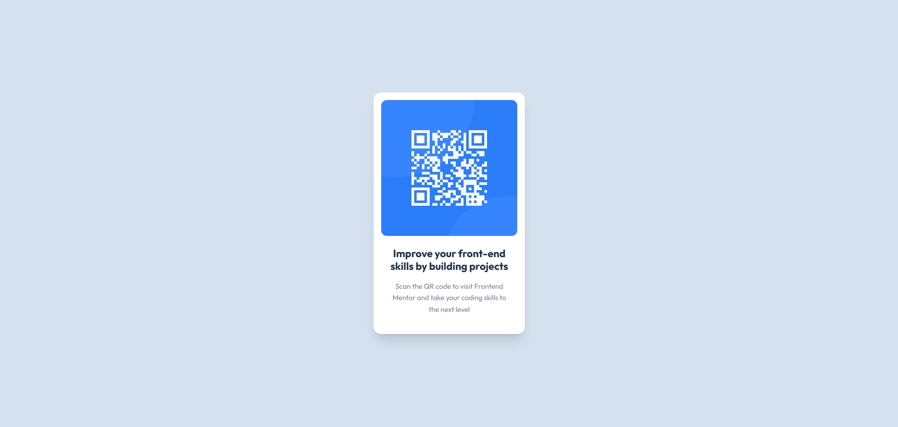

# 🧩 Proyecto: Componente QR Code

Este proyecto consiste en el desarrollo de un **componente de Código QR** utilizando **Astro** y **Tailwind CSS**.  
El objetivo es aplicar los conocimientos sobre **componentes**, **maquetación**, **estilos responsivos** y **utilidades CSS** para construir un diseño limpio, moderno y adaptable a diferentes dispositivos, basado en un reto de Frontend Mentor.

---

## 📖 Descripción general

### 🧩 Vista previa del proyecto



---

### 🔗 Enlaces del proyecto

- **Repositorio en GitHub:** [DiegoNatanael/QR-Code-Component](https://github.com/DiegoNatanael/QR-Code-Component/tree/main)
- **Sitio desplegado:** [GitHub Pages Live Demo](https://diegonatanael.github.io/QR-Code-Component/)

---

## 🧠 Proceso de desarrollo

### 🛠️ Tecnologías utilizadas

- [Astro](https://astro.build) - Framework para sitios orientados a contenido.
- [Tailwind CSS](https://tailwindcss.com/) - Framework CSS basado en utilidades.
- **HTML5 semántico** - Uso de etiquetas como `<main>`, `<article>`, `<h1>`, etc.
- **Diseño responsivo** - Adaptabilidad garantizada mediante utilidades de Tailwind.
- **Google Fonts** - Tipografía Outfit integrada para coincidir con el diseño original.

---

### 💡 Lo que aprendí

En este proyecto reforcé el uso de **Astro Components** y la integración de **Tailwind CSS** para estilizar elementos de forma rápida y precisa. Aprendí a manejar rutas relativas para el despliegue en GitHub Pages y a estructurar componentes de manera semántica.

Ejemplo de la estructura del componente:
```astro
<article class="bg-white p-4 rounded-2xl shadow-xl max-w-[320px] text-center">
  <div class="rounded-xl overflow-hidden mb-6">
    
  </div>
  <div class="px-3 pb-6">
    <h1 class="text-[#1F314F] text-[22px] font-bold leading-tight mb-4">
      Improve your front-end skills by building projects
    </h1>
    <p class="text-[#7D889E] text-[15px] leading-relaxed">
      Scan the QR code to visit Frontend Mentor and take your coding skills to the next level
    </p>
  </div>
</article>
```

---

### 🚀 Comandos Útiles

| Comando | Acción |
| :--- | :--- |
| `npm install` | Instala las dependencias del proyecto. |
| `npm run dev` | Inicia el servidor de desarrollo local en `localhost:4321`. |
| `npm run build` | Genera el sitio de producción en la carpeta `./dist/`. |
| `npm run preview` | Previsualiza la versión de producción localmente. |

---

### 👩‍💻 Autor

- **Nombre completo:** Diego Natanael Gonzalez Esparza
- **Carrera:** TICS
- **Semestre/Grupo:** 6to
- **Correo institucional:** 23151206@aguascalientes.tecnm.mx

---

### ✨ Reflexión final

El desarrollo de este componente fue una excelente práctica de maquetación rápida. Lo mejor fue lograr la precisión en los espacios y sombras para que el diseño se sintiera premium.
